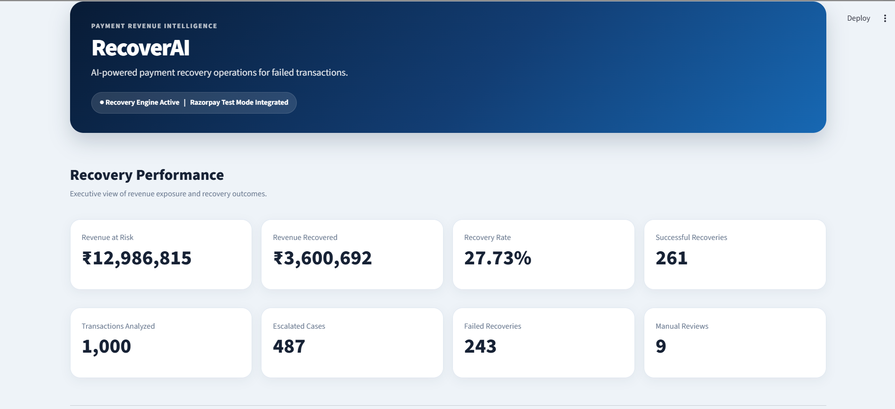

# 🚀 RecoverAI

### 🤖 AI-Powered Payment Revenue Recovery Agent

> **Detect → Score → Decide → Recover → Audit**

RecoverAI is an AI-powered payment revenue recovery system designed to help merchants intelligently respond to failed payment transactions.

Instead of treating every failed payment the same way, RecoverAI analyzes transaction context, evaluates recovery risk and priority, recommends a bounded recovery action, explains the decision, generates a customer-facing recovery message, supports payment-link recovery through **Razorpay Test Mode**, and records the recovery workflow through an audit trail.

---

## ⚡ Why RecoverAI?

A failed payment does not always mean permanently lost revenue.

Different payment failures can require different interventions.

```text
                    FAILED PAYMENT
                          │
                          ▼
                  🔎 Analyze Context
                          │
                          ▼
                🧠 Recovery Intelligence
                          │
                 ┌────────┴────────┐
                 ▼                 ▼
            Risk Score        Priority Score
                 │                 │
                 └────────┬────────┘
                          ▼
                  🎯 Recovery Decision
                          │
        ┌─────────┬───────┼────────┬──────────┐
        ▼         ▼       ▼        ▼          ▼
      Retry    Reminder  Prompt  Payment   Escalate
                                  Link
                                    │
                                    ▼
                              💳 Razorpay
                                    │
                                    ▼
                              📋 Audit Trail
```

> **The goal:** Don't just report failed payments. Decide what should happen next and make the recovery workflow actionable.

---

## 📊 Prototype Results

RecoverAI was evaluated against **1,000 synthetic failed-payment transactions**.

| Metric | Result |
|---|---:|
| 🔢 Transactions analyzed | **1,000** |
| 💰 Revenue at risk | **₹12,986,814.54** |
| 💵 Simulated recovered revenue | **₹3,600,691.67** |
| 📈 Simulated recovery rate | **27.73%** |
| 🛑 Stop & Escalate | **487** |
| 🔄 Retry | **192** |
| 💬 Customer Prompt | **136** |
| 💳 Payment Link | **124** |
| 🔔 Reminder | **52** |
| 👤 Manual Review | **9** |

> ⚠️ **Important:** The transaction dataset and recovery outcomes are synthetic/simulated for this prototype. Razorpay integration is demonstrated using **Test Mode**.

---

## 🧠 How RecoverAI Works

### 1️⃣ Detect
Identify failed payment transactions and the associated revenue at risk.

### 2️⃣ Analyze
Evaluate failure reason, previous attempts, transaction amount, recovery characteristics, and available transaction history.

### 3️⃣ Score
RecoverAI calculates recovery score, recovery risk, priority score, and priority level.

### 4️⃣ Decide
The recovery engine recommends an appropriate bounded action:

```text
🔄 RETRY
🔔 REMINDER
💬 CUSTOMER_PROMPT
💳 PAYMENT_LINK
👤 MANUAL_REVIEW
🛑 STOP_AND_ESCALATE
```

### 5️⃣ Explain
The system generates a human-readable explanation for the recommended recovery action.

### 6️⃣ Recover
Eligible payment-link recovery cases can be executed through **Razorpay Test Mode**.

### 7️⃣ Audit
The recovery workflow is recorded so that the decision and intervention remain traceable.

---

## 🤖 AI Recovery Intelligence

RecoverAI adds an intelligence layer to the payment recovery workflow.

### 🧠 Recovery Score
Estimates the recovery potential of a failed transaction.

### ⚠️ Recovery Risk
Transactions are categorized into:

```text
🔴 HIGH
🟡 MEDIUM
🟢 LOW
```

### 🎯 Priority
Priority scoring helps determine which transactions should be handled first.

### 💡 Recommended Action
RecoverAI chooses an appropriate recovery intervention instead of applying the same strategy to every failed payment.

### 🔍 Decision Explanation
RecoverAI provides a human-readable explanation of why the recommended action was selected.

---

## 🛡️ Bounded Recovery & Escalation

RecoverAI is designed around **bounded recovery actions** rather than unlimited retries.

The recovery engine can select from:

```text
🔄 Retry
🔔 Reminder
💬 Customer Prompt
💳 Payment Link
👤 Manual Review
🛑 Stop & Escalate
```

> **Recover revenue without creating uncontrolled retry loops or unnecessary customer friction.**

---

## 💳 Razorpay Integration

RecoverAI integrates with the Razorpay Python SDK for payment-link based recovery.

```text
RecoverAI Decision
       │
       ▼
PAYMENT_LINK selected
       │
       ▼
Create Razorpay Test Payment Link
       │
       ▼
Razorpay Payment Link ID
       │
       ▼
Customer-facing Payment URL
       │
       ▼
Audit Record
```

### ⭐ Example Recovery Case

```text
Transaction:        TXN10019
Customer:           CUST1297
Amount at Risk:     ₹7,526.81
Recommended Action: PAYMENT_LINK
Razorpay Status:    created
Environment:        Test Mode
```

> 🧪 **Test Mode:** No real customer funds are moved by this prototype.

> 🔐 **Security:** Razorpay credentials are loaded from environment variables and are not stored in the repository.

---

## 📋 Audit Trail

RecoverAI records the recovery workflow so decisions remain traceable.

Recorded information includes:

- Transaction ID
- Customer ID
- Amount
- Failure reason
- Previous attempts
- Recovery score
- Recovery risk
- Priority score
- Priority
- Recommended decision
- Customer recovery message
- Razorpay payment-link information when applicable
- Audit status

```text
🔎 Transaction Detected
          ↓
🧠 AI Analysis
          ↓
🎯 Recovery Decision
          ↓
💳 Recovery Action
          ↓
📊 Recovery Outcome
          ↓
📋 Audit Recorded
```

---

## 📊 Operations Dashboard

RecoverAI includes a Streamlit operations dashboard designed for recovery teams.

### 💰 Revenue Overview
- Revenue at risk
- Simulated recovered revenue
- Recovery rate
- Successful recoveries
- Transactions analyzed

### 📈 Recovery Analytics
- Recovery-risk distribution
- Recommended recovery actions
- Recovery outcomes

### 🎯 Recovery Queue
Operations teams can filter transactions by risk, priority, and recommended recovery action.

### 🔍 Transaction Investigation
Individual transactions can be inspected for payment details, failure reason, recovery score, recovery risk, priority, recommended action, AI explanation, customer recovery message, recovery outcome, Razorpay information, and audit status.

---

## 🏗️ System Architecture

```text
┌────────────────────────────────────┐
│      Synthetic Transaction Data    │
│            1,000 Records           │
└──────────────────┬─────────────────┘
                   │
                   ▼
┌────────────────────────────────────┐
│            Risk Engine             │
│     Recovery Risk + Assessment     │
└──────────────────┬─────────────────┘
                   │
                   ▼
┌────────────────────────────────────┐
│          Recovery Engine           │
│       Action Recommendation        │
└──────────────────┬─────────────────┘
                   │
                   ▼
┌────────────────────────────────────┐
│        AI Recovery Agent           │
│      Decision + Explanation        │
└──────────────────┬─────────────────┘
                   │
          ┌────────┴─────────┐
          ▼                  ▼
┌─────────────────┐  ┌────────────────────┐
│ Customer Message│  │ Razorpay Test Mode │
└─────────────────┘  │   Payment Link     │
                     └─────────┬──────────┘
                               │
                               ▼
                     ┌────────────────────┐
                     │    Audit Trail     │
                     └─────────┬──────────┘
                               │
                               ▼
                     ┌────────────────────┐
                     │ Operations         │
                     │ Dashboard          │
                     └────────────────────┘
```

---

## 🔄 End-to-End Recovery Flow

```text
Failed Payment
      ↓
Identify Revenue at Risk
      ↓
Analyze Failure Context
      ↓
Calculate Recovery Score
      ↓
Calculate Risk + Priority
      ↓
Select Recovery Action
      ↓
Explain Decision
      ↓
Generate Customer Message
      ↓
Execute Eligible Recovery Action
      ↓
Record Outcome
      ↓
Audit Trail
```

---

## 📁 Project Structure

```text
recoverai/
│
├── 📊 dashboard.py
├── 🤖 ai_recovery_agent.py
├── 🧠 recoverai_agent.py
├── ⚠️ risk_engine.py
├── 🎯 recovery_engine.py
├── 💡 decision_explainer.py
├── 💬 message_generator.py
├── 💳 razorpay_integration.py
├── 📋 audit_trail.py
├── 📈 batch_risk_evaluation.py
├── 📊 evaluate_recovery.py
├── 🧪 simulate_recovery.py
├── 🚀 run_recoverai.py
├── 🤖 generate_ai_results.py
│
├── 🧪 test_engine.py
├── 🧪 test_risk_engine.py
├── 🧪 test_decision_explainer.py
├── 🧪 test_message_generator.py
│
├── 📁 data/
│   └── recoverai_transactions_1000.csv
│
├── 📦 requirements.txt
├── 🔐 .gitignore
└── 📖 README.md
```

---

## 🧩 Core Components

| Component | Responsibility |
|---|---|
| `risk_engine.py` | Calculates recovery risk |
| `recovery_engine.py` | Determines the recommended recovery action |
| `ai_recovery_agent.py` | AI recovery decision layer |
| `recoverai_agent.py` | Recovery workflow orchestration |
| `decision_explainer.py` | Generates decision explanations |
| `message_generator.py` | Generates customer recovery messages |
| `razorpay_integration.py` | Razorpay Test Mode payment-link integration |
| `simulate_recovery.py` | Simulates recovery outcomes |
| `audit_trail.py` | Records recovery audit information |
| `dashboard.py` | Streamlit operations dashboard |
| `run_recoverai.py` | Runs the recovery workflow |
| `evaluate_recovery.py` | Evaluates recovery performance |
| `batch_risk_evaluation.py` | Evaluates recovery risk across transactions |
| `generate_ai_results.py` | Generates AI-layer results |

---

## 🚀 Getting Started

### 1. Clone the repository

```bash
git clone https://github.com/sandipjadhav87/recoverai.git
cd recoverai
```

### 2. Create a virtual environment

#### Windows

```powershell
python -m venv .venv
.venv\Scriptsctivate
```

#### macOS / Linux

```bash
python -m venv .venv
source .venv/bin/activate
```

### 3. Install dependencies

```bash
pip install -r requirements.txt
```

### 4. Configure Razorpay Test Mode

Create a local `.env` file:

```env
RAZORPAY_KEY_ID=your_test_key_id
RAZORPAY_KEY_SECRET=your_test_key_secret
```

> ⚠️ Never commit `.env` or expose API secrets publicly.

### 5. Run RecoverAI

```bash
python run_recoverai.py
```

### 6. Launch the dashboard

```bash
streamlit run dashboard.py
```

Then open:

```text
http://localhost:8501
```

---

## 🧪 Testing

RecoverAI includes tests for core components.

```bash
python -m unittest discover
```

Individual tests:

```bash
python test_engine.py
python test_risk_engine.py
python test_decision_explainer.py
python test_message_generator.py
```

---

## 🔐 Security & Responsible Execution

RecoverAI follows several principles for automated recovery:

- 🔐 API credentials are stored in environment variables.
- 🧪 Razorpay integration uses Test Mode.
- 🚫 Runtime-generated result files are excluded from version control.
- 🛑 Recovery decisions include bounded actions and escalation paths.
- 📋 Recovery actions are recorded for auditability.
- 👤 Cases requiring additional intervention can be routed toward manual review or escalation.
- 🔁 Different failure conditions can result in different recovery strategies.

---

## 🎥 Demo Workflow

The product demonstration focuses on one complete recovery journey:

```text
Failed Payment
      ↓
🔎 Analyze
      ↓
🧠 Score Recovery Potential
      ↓
⚠️ Determine Risk
      ↓
🎯 Prioritize
      ↓
💡 Explain Decision
      ↓
💳 Create Razorpay Test Payment Link
      ↓
💬 Customer Recovery Message
      ↓
📋 Audit Trail
```

### ⭐ Featured Demo Transaction

```text
Transaction:        TXN10019
Customer:           CUST1297
Amount at Risk:     ₹7,526.81
Recommended Action: PAYMENT_LINK
Razorpay Status:    created
Environment:        Test Mode
```

---

## 🌟 What Makes RecoverAI Different?

Traditional payment monitoring often answers:

> **“Which payments failed?”**

RecoverAI aims to answer:

> **“Which failed payments are worth recovering, what should we do next, why is that action appropriate, and can we execute and audit the recovery workflow?”**

This creates a complete operational loop:

```text
Monitor
   ↓
Understand
   ↓
Decide
   ↓
Act
   ↓
Measure
   ↓
Audit
```

---

## 🎯 Vision

RecoverAI aims to move payment recovery from:

> **“A payment failed.”**

to:

> **“A payment failed — here's why, here's the recovery opportunity, here's the next action, and here's the complete record of what happened.”**

---

## ⚠️ Prototype Disclaimer

RecoverAI is a buildathon prototype using **synthetic transaction data** and **simulated recovery outcomes**.

The reported recovery metrics are evaluation metrics for the prototype and should not be interpreted as production financial results.

Razorpay functionality is demonstrated using **Test Mode**.

---

# 🚀 RecoverAI

### **Detect. Score. Decide. Recover. Audit.**

**Turning failed payments into recoverable revenue.**

---

## 📸 Product Demo

### 🏠 Operations Dashboard

The RecoverAI dashboard provides an executive view of revenue exposure, recovered revenue, recovery rate, successful recoveries, escalations, and failed recoveries.



### 🔍 Recovery Queue

The recovery queue allows operators to search and prioritize failed transactions based on risk, priority, and recommended recovery action.


### 🧠 Transaction Investigation

RecoverAI explains why a particular recovery action was selected, including recovery score, risk, priority, failure reason, and recommended intervention.

